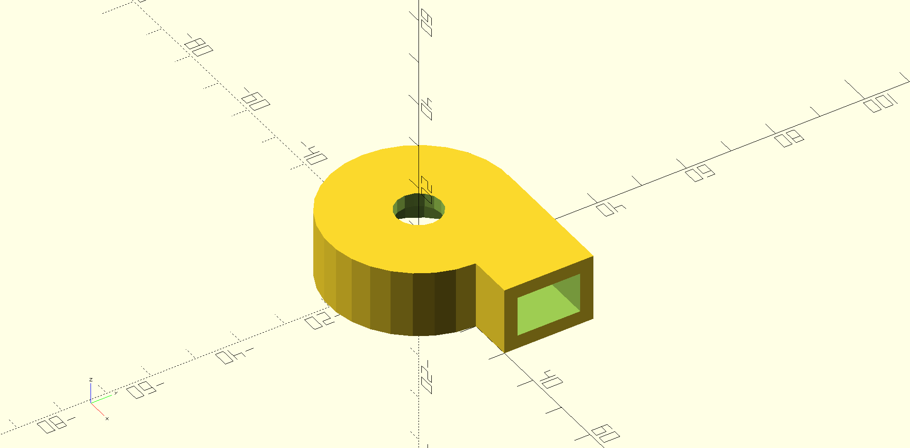
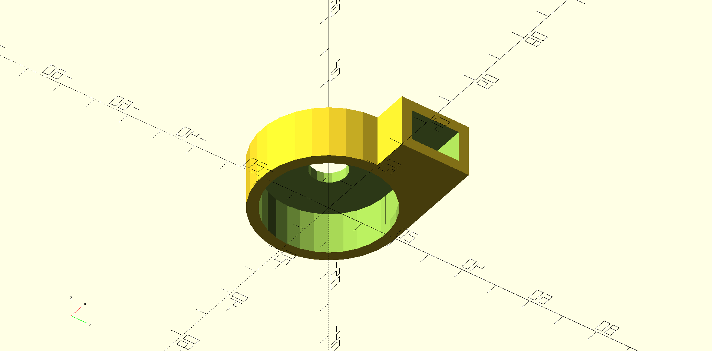

# Lua-cad

OpenSCAD for Lua, 使用 lua 来创建三维模型。

<!-- PROJECT SHIELDS -->

[![Contributors][contributors-shield]][contributors-url]
[![Forks][forks-shield]][forks-url]
[![Stargazers][stars-shield]][stars-url]
[![Issues][issues-shield]][issues-url]
[![GPLv3 License][license-shield]][license-url]


<!-- PROJECT LOGO -->
<br />

<p align="center">
  <a href="https://github.com/SongZihui-sudo/lua-cad/">
    
  </a>

  <h3 align="center">Lua-cad</h3>
  <p align="center">
    OpenSCAD for Lua, 使用 lua 来快速创建三维模型。
    <br />
    <a href="./doc/index.md"><strong>探索本项目的文档 »</strong></a>
    <br />
    <br />
    <a href = "https://github.com/SongZihui-sudo/lua-cad/issues/new">报告Bug</a>
    ·
    <a href="https://github.com/SongZihui-sudo/lua-cad/issues">提出新特性</a>
    ·
    <a href="./readme_en.md">English</a>
  </p>

</p>
 
## 目录

- [Lua-cad](#lua-cad)
  - [目录](#目录)
    - [**特性**](#特性)
      - [**使用基准实现准确定位**](#使用基准实现准确定位)
      - [**快速移植，复用现有代码，兼容 openscad 的模块调用语句**](#快速移植复用现有代码兼容-openscad-的模块调用语句)
      - [**面向对象**](#面向对象)
    - [Example](#example)
        - [简单的离心风机外壳](#简单的离心风机外壳)
        - [复用 openscad](#复用-openscad)
        - [基本操作](#基本操作)
    - [文档](#文档)
    - [上手指南](#上手指南)
          - [**源码编译**](#源码编译)
        - [**使用说明**](#使用说明)
    - [架构图](#架构图)
    - [文件目录说明](#文件目录说明)
    - [使用到的开源项目](#使用到的开源项目)
    - [贡献者](#贡献者)
      - [如何参与开源项目](#如何参与开源项目)
    - [版本控制](#版本控制)
    - [作者](#作者)
    - [版权说明](#版权说明)
    - [鸣谢](#鸣谢)

### **特性**

#### **使用基准实现准确定位**  

在 lua-cad 中使用基准 `datum` 可以精准确定 3d 对象的基准面，以此根据对象间的几何关系来实行准确定位。
```lua
local datum1 = d3object.datum(cube1, 1);
```
使用 `d3object.datum(obj, index)` 函数来获取基准面中心的位置，并通过 `datum` 库来进行几何关系的处理。

#### **快速移植，复用现有代码，兼容 openscad 的模块调用语句**  

在 lua-cad 中快速复用您再 `openscad` 中创建模块。
```lua
local shoulder_screw1 = $shoulder_screw( "english", 1/2, length = 20 )$;
```
使用 `$` 来在 Lua-cad 创建您要在 openscad 文件中定义的模块，这会将其转换唯一个 `table` 类型的变量。在 `user_define_obj` 库中，您可以对其进行进一步的操作。[用户自定义对象库](./doc/user_define_object.md)。

#### **面向对象**

采用面向对象的模式，高效复用代码，编码更加灵活，增加了维护性。

### Example

##### 简单的离心风机外壳

[Example](./Example/fan_housing/fan_housing.lua)  



##### 复用 openscad

```lua
-- The directory is specified according to the actual situation
package.path = package.path ..';../../../../?.lua';
user_obj = require("src.user_object.user_obj")

-- test1
test1 = $shoulder_screw( "english", 1/2, length = 20 )$;

test1.postion(test1, {10, 10, 10});

print("offset");
print("x: ".. test1._offset[1]);
print("x: ".. test1._offset[2]);
print("x: ".. test1._offset[3]);
print("test1");
test1.print(test1);

-- test2
test2 = $screw( "#6-32", head="flat undercut",length=12)$;
print("test2")
test2.print(test2);
```

##### 基本操作

```lua
d3object = require("d3object")
boolean = require("boolean")
transform = require("transform")

local cube1 = d3object.cube({ 10, 10, 10 }, true);
local cube2 = d3object.cube({ 10, 10, 10 }, false);

local difference1 = boolean.difference({cube1, cube2});
local difference2 = boolean.difference({difference1, cube1});
local difference3 = boolean.difference({cube1, cube2, difference2});
local union1 = boolean.union({difference1, difference2});
local intersection1 = boolean.intersection({union1, difference3});

print("difference1 code1 : \n" .. code(intersection1));

export("./export.scad", intersection1);
```

### 文档

[详细文档](./doc/index.md)

### 上手指南

###### **源码编译**

1. 安装 `xmake`  
   - [xmake安装方法](https://xmake.io/#/guide/installation)
2. Clone the repo
```sh
git clone https://github.com/SongZihui-sudo/lua-cad.git
```
3. cd lua-cad
4. 编译源码
```sh
xmake
```

##### **使用说明**

```sh
lua-cad [filepath]
```
如果输入了参数 `filepath` 那么直接运行脚本 `filepath` 所指向的文件。否则从终端读取输入。


### 架构图


### 文件目录说明

eg:

```
filetree
├── doc
│   └── English
├── lua
│   ├── manual
│   └── testes
│       └── libs
│           └── P1
├── port
│   └── openscad
├── src
│   ├── base_object
│   └── user_object
└── test
```

/doc 文档。  
/lua lua 源码，个别文件进行了修改。  
/port 文件导出与渲染接口。  
/src 源码。  
/src/base_object 基础对象源码。  
/src/user_object 用户定义对象源码。

### 使用到的开源项目

- [lua](https://lua.org/)

### 贡献者

#### 如何参与开源项目

贡献使开源社区成为一个学习、激励和创造的绝佳场所。你所作的任何贡献都是**非常感谢**的。


1. Fork the Project
2. Make some Changes
3. Commit your Changes (`git commit -m 'Add some feature'`)
4. Push to the Branch to you repo (`git push`)
5. Open a Pull Request to `feature` Branch.

### 版本控制

该项目使用Git进行版本管理。您可以在 repository 参看当前可用版本。

### 作者

SongZihui-sudo

mail: 1751122876@qq.com  


### 版权说明

该项目签署了 GPLv3 授权许可，详情请参阅 [LICENSE.txt](./LICENSE.txt)

### 鸣谢


- [lua](https://lua.org/)
- [openscad](https://openscad.org/index.html)

<!-- links -->
[your-project-path]:SongZihui-sudo/lua-cad
[contributors-shield]: https://img.shields.io/github/contributors/SongZihui-sudo/lua-cad.svg?style=flat-square
[contributors-url]: https://github.com/SongZihui-sudo/lua-cad/graphs/contributors
[forks-shield]: https://img.shields.io/github/forks/SongZihui-sudo/lua-cad.svg?style=flat-square
[forks-url]: https://github.com/SongZihui-sudo/lua-cad/network/members
[stars-shield]: https://img.shields.io/github/stars/SongZihui-sudo/lua-cad.svg?style=flat-square
[stars-url]: https://github.com/SongZihui-sudo/lua-cad/stargazers
[issues-shield]: https://img.shields.io/github/issues/SongZihui-sudo/lua-cad.svg?style=flat-square
[issues-url]: https://github.com/SongZihui-sudo/lua-cad/issues
[license-shield]: https://img.shields.io/github/license/SongZihui-sudo/lua-cad.svg?style=flat-square
[license-url]: ./LICENSE.txt

[](https://star-history.com/#SongZihui-sudo/lua-cad&Date)  
