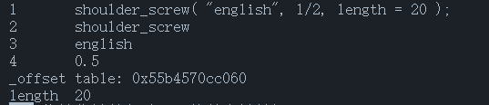
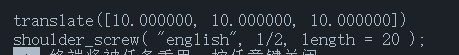

# Custom object

- [Custom object](#custom-object)
  - [Reuse openscad library](#reuse-openscad-library)
    - [Usage](#usage)
    - [Table\_structure](#table_structure)
    - [Example](#example)
  - [Related\_methods](#related_methods)
    - [postion](#postion)
      - [Usage](#usage-1)
      - [Example](#example-1)
    - [scale](#scale)
      - [Usage](#usage-2)
      - [Example](#example-2)
    - [mirror](#mirror)
      - [Usage](#usage-3)
      - [Example](#example-3)
    - [rotate](#rotate)
      - [Usage](#usage-4)
      - [Example](#example-4)
    - [color](#color)
      - [Usage](#usage-5)
      - [Example](#example-5)
    - [print](#print)
      - [Usage](#usage-6)
      - [Example](#example-6)
        - [Output](#output)
    - [code](#code)
      - [Usage](#usage-7)
      - [Example](#example-7)
        - [Output](#output-1)
  - [chunk](#chunk)
    - [Usage](#usage-8)
    - [Example](#example-8)
    - [method](#method)
      - [code](#code-1)


Custom objects allow you to reuse existing openscad libraries and create more flexible models.

## Reuse openscad library

> require("user_obj")

### Usage

```lua
$ name( var = number | string | table | nil | boolean , number | string | table | nil | boolean ............ ) $
```

Through the code inserted between `$$`, the user can call the module and openscad library created in the openscad file, but before doing so, `include` must be performed. Global function [include](./gloal_function.md#include).
A `table` type will be returned, and a metatable has been added to this table, which can be further manipulated through a series of methods. [Related methods](#method)

### Table_structure

| Table |
| ----- |
|The code content between `$`|
| name |
| arg1 |
| arg2 |
| .... |

### Example

```lua
local shoulder_screw1 = $shoulder_screw( "english", 1/2, length = 20 )$;

-- or
local hole = $screw_hole("1/4-20,.5",head="socket",counterbore=5, anchor= 0)$;
```

## Related_methods

> require("user_obj")

### postion

#### Usage

```lua
user_obj.postion(user_obj, {x, y, z});
```

- user_obj
   - `table` type
     - The object to be operated on.
- {x, y, z}
   - `table` type
     - The location of the object.

Add the field _offset to user_obj, with a length of 3, and record the position of user_obj.
Consistent with position in [transform](./transform.md#set position).

#### Example

```lua
local shoulder_screw1 = $shoulder_screw( "english", 1/2, length = 20 )$;
shoulder_screw1.postion(shoulder_screw1, {10, 10, 10});
```

### scale

#### Usage

```lua
user_obj.scale(user_obj, {10, 10, 10});
```

- user_obj
   - `table` type
     - The object to be operated on.
- {x, y, z}
   - `table` type
     - Zoom factor

Consistent with scale in [transform](./transform.md#scale).

#### Example

```lua
local shoulder_screw1 = $shoulder_screw( "english", 1/2, length = 20 )$;
shoulder_screw1.scale(shoulder_screw1, {10, 10, 10});
```

### mirror

#### Usage

```lua
user_obj.mirror(test1, {x, y, z});
```

- user_obj
   - `table` type
     - The object to be operated on.
- {x, y, z}
   - `table` type
     - The normal vector of the mirror plane intersecting the origin.

Consistent with mirror in [transform](./transform.md#mirror).

#### Example

```lua
local shoulder_screw1 = $shoulder_screw( "english", 1/2, length = 20 )$;
shoulder_screw1.mirror(shoulder_screw1, {10, 10, 10});
```

### rotate

#### Usage

Consistent with rotate in [transform](./transform.md#rotation).

#### Example

```lua
local shoulder_screw1 = $shoulder_screw( "english", 1/2, length = 20 )$;
shoulder_screw1.rotate(shoulder_screw1, 1, {10, 10, 10})
print(shoulder_screw1.code(shoulder_screw1));

-- or
shoulder_screw1.rotate(shoulder_screw1, {4, 5, 6});
print(shoulder_screw1.code(shoulder_screw1));

-- or
shoulder_screw1.rotate(shoulder_screw1, {1, 2, 3}, {4, 5, 6});
print(shoulder_screw1.code(shoulder_screw1));

-- or
shoulder_screw1.rotate(shoulder_screw1, 1, {4, 5, 6});
print(shoulder_screw1.code(shoulder_screw1));
```

### color

#### Usage

Consistent with color in [transform](./transform.md#color).

#### Example

```lua
local shoulder_screw1 = $shoulder_screw( "english", 1/2, length = 20 )$;
shoulder_screw1.color(shoulder_screw1, "xxx");
print(shoulder_screw1.code(shoulder_screw1));

-- or
shoulder_screw1.color(shoulder_screw1, "xxx", 1);
print(shoulder_screw1.code(shoulder_screw1));

--or
shoulder_screw1.color(shoulder_screw1, {1,2,3}, 1);
print(shoulder_screw1.code(shoulder_screw1));

-- or
shoulder_screw1.color(shoulder_screw1, {1,2,3,4}, 1);
print(shoulder_screw1.code(shoulder_screw1));
```

### print

#### Usage

```lua
user_obj.print(user_obj);
```

- user_obj
   - `table` type
     - The object to view.

Print out the contents of the current object (only one level is included, not all contents are printed recursively).

#### Example

```lua
local shoulder_screw1 = $shoulder_screw( "english", 1/2, length = 20 )$;
shoulder_screw1.print(shoulder_screw1);
```
##### Output



### code

#### Usage

```lua
user_obj.code(user_obj);
```

- user_obj
   - `table` type
     - The object whose code is to be exported.

Exports the Openscad code of the current object.

#### Example

```lua
local shoulder_screw1 = $shoulder_screw( "english", 1/2, length = 20 )$;
shoulder_screw1.code(shoulder_screw1);
```

##### Output



[transform](./transform.md)

## chunk

> require("chunk")

### Usage

```lua
name = {};
setmetatable(name, chunk);
```

A collection of d3object and user_obj.

### Example

```lua
chunk1 = {shoulder_screw_include, difference1};
setmetatable(chunk1, chunk);
print(chunk1.code(chunk1));
```

### Method

#### code

```lua
print(chunk1.code(chunk1));
```

Print the openscad code block composed of all elements in the current chunk, pay attention to the order.
