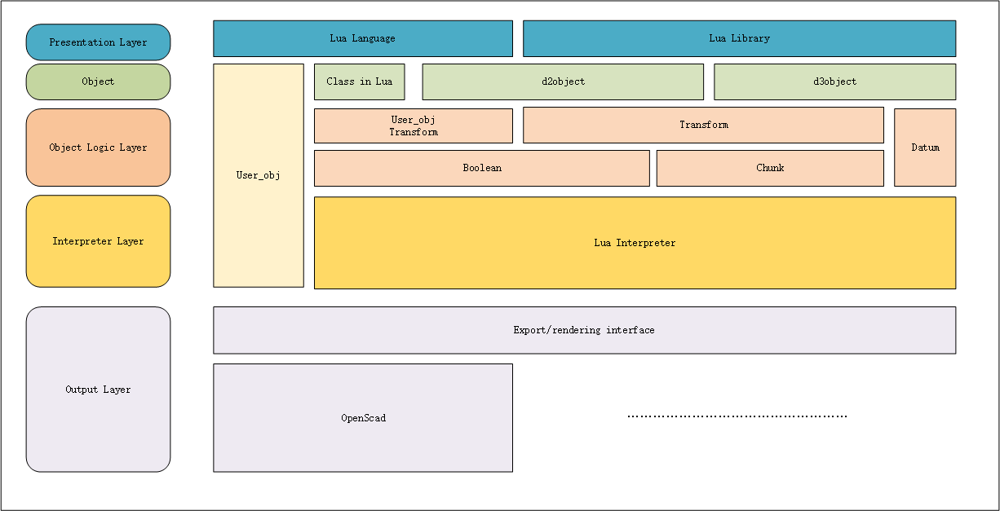
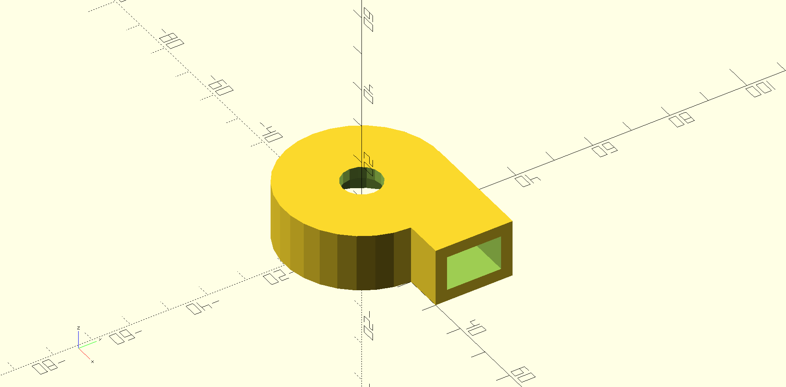
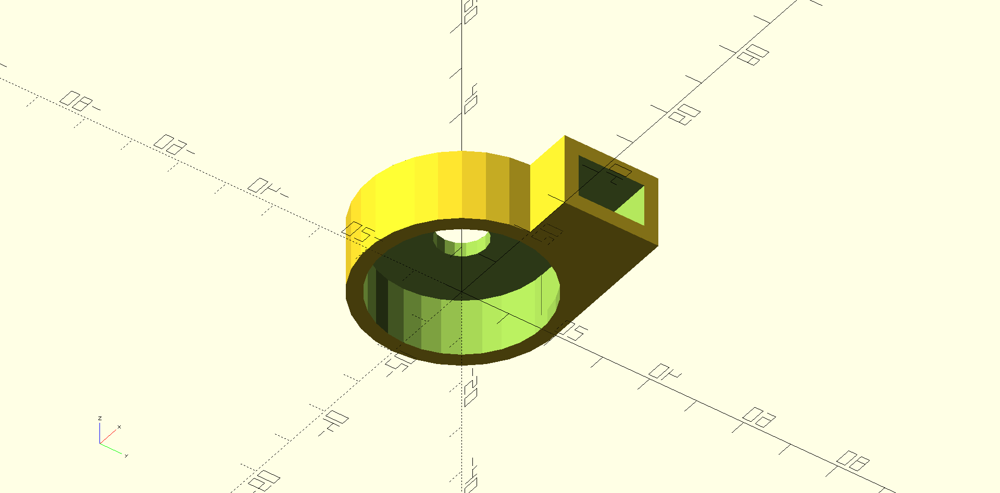

#! https://zhuanlan.zhihu.com/p/681776259
# Lua-cad

> OpenSCAD for Lua, 使用 lua 来创建三维模型。

[Lua](https://www.runoob.com/lua/lua-tutorial.html)   
[项目地址](https://github.com/SongZihui-sudo/lua-cad)  
[Release v1.0.0 下载](https://github.com/SongZihui-sudo/lua-cad/releases/tag/v1.0.0)  

- [Lua-cad](#lua-cad)
  - [新特性](#新特性)
    - [兼容 Openscad](#兼容-openscad)
    - [参数化建模](#参数化建模)
    - [建模更加直观，直接](#建模更加直观直接)
    - [面向对象](#面向对象)
    - [易于嵌入、快速执行](#易于嵌入快速执行)
  - [Quick Start](#quick-start)
    - [**Release 下载**](#release-下载)
    - [**源码编译**](#源码编译)
    - [**使用说明**](#使用说明)
    - [架构图](#架构图)
  - [Example](#example)
    - [简单的离心风机外壳](#简单的离心风机外壳)


## 新特性

### 兼容 Openscad

lua-cad 兼容当前 openscad 的大部分库。可以直接使用 `$` 来在 Lua-cad 创建您要在 openscad 文件中定义的模块，这会将其转换唯一个 `table` 类型的变量。在 `user_define_obj` 库中，您可以对其进行进一步的操作。
**一个例子:**     
```lua
local shoulder_screw1 = $shoulder_screw( "english", 1/2, length = 20 )$;
```
**表结构：**
| Table |
| ----- |
| `$`间的代码内容|
| name |
| arg1 |
| arg2 |
| .... |

**内含方法：**   
- postion
- scale
- mirror
- rotate
- color
- print
- code

[用户自定义对象库](https://github.com/SongZihui-sudo/lua-cad/blob/master/doc/user_define_object.md)。 

### 参数化建模

采用参数化建模的方法，相对于 GUI 方式，GUI 操作并不能很好反应出参数值间关系。对于复杂的模型来说，GUI 界面会来带来大量繁琐，复杂的操作，纯粹依赖GUI界面可能会导致操作耗时，效率低下。  
使用编程接口可以高效复用已经创建的模型，并且更加健壮，这使得在模型中进行修改和调整变得非常容易，而无需手动编辑每个单独的形状。

### 建模更加直观，直接

在 lua-cad 中使用基准 `datum` 可以精准确定 3d 对象的基准面，以此根据对象间的几何关系来实行准确定位。
```lua
local datum1 = d3object.datum(cube1, 1);
```
使用 `d3object.datum(obj, index)` 函数来获取基准面中心的位置，并通过 `datum` 库来进行几何关系的处理。  

### 面向对象

采用面向对象的模式，高效复用代码，编码更加灵活，增加了维护性。

### 易于嵌入、快速执行

程序轻量，高效，易于嵌入与增加接口。   

## Quick Start

### **Release 下载**

[Release v1.0.0 下载](https://github.com/SongZihui-sudo/lua-cad/releases/tag/v1.0.0)

### **源码编译**

1. 安装 `xmake`  
   - [xmake安装方法](https://xmake.io/#/guide/installation)
2. Clone the repo
```sh
git clone https://github.com/SongZihui-sudo/lua-cad.git
```
3. cd lua-cad
4. 编译源码
```sh
xmake
```

### **使用说明**

```sh
lua-cad [filepath]
```
如果输入了参数 `filepath` 那么直接运行脚本 `filepath` 所指向的文件。否则从终端读取输入。  


### 架构图


## Example

### 简单的离心风机外壳

[Example](https://github.com/SongZihui-sudo/lua-cad/blob/master/Example/fan_housing/fan_housing.lua)    
  


**导出的openscad代码:**
```openscad
difference()
{
union()
{
cylinder(h = 15.000000, r = 20.000000,  center = false);
cube([30.000000, 20.000000, 15.000000], center = false);

}
cylinder(h = 12.000000, r = 17.000000,  center = false);
translate([0.000000, 0.000000, 12.000000])
cylinder(h = 10.000000, r = 5.000000,  center = false);
translate([0.000000, 3.000000, 3.000000])
cube([30.000000, 14.000000, 9.000000], center = false);

}
```

[项目地址](https://github.com/SongZihui-sudo/lua-cad)  
[Release v1.0.0 下载](https://github.com/SongZihui-sudo/lua-cad/releases/tag/v1.0.0)
