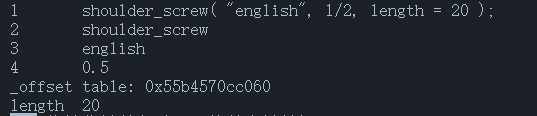
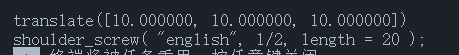

# 自定义对象

- [自定义对象](#自定义对象)
  - [复用 openscad 库](#复用-openscad-库)
    - [用法](#用法)
    - [返回的表结构](#返回的表结构)
    - [例子](#例子)
  - [相关方法](#相关方法)
    - [postion](#postion)
      - [用法](#用法-1)
      - [例子](#例子-1)
    - [scale](#scale)
      - [用法](#用法-2)
      - [例子](#例子-2)
    - [mirror](#mirror)
      - [用法](#用法-3)
      - [示例](#示例)
    - [rotate](#rotate)
      - [用法](#用法-4)
      - [例子](#例子-3)
    - [color](#color)
      - [用法](#用法-5)
      - [例子](#例子-4)
    - [print](#print)
      - [用法](#用法-6)
      - [例子](#例子-5)
        - [输出](#输出)
    - [code](#code)
      - [用法](#用法-7)
      - [例子](#例子-6)
        - [输出](#输出-1)
  - [chunk](#chunk)
    - [用法](#用法-8)
    - [示例](#示例-1)
    - [方法](#方法)
      - [code](#code-1)

[English](./English/user_define_object.md)   
通过自定义对象，可以复用现有的 openscad 库以及可以创建更加灵活的模型。

## 复用 openscad 库

> require("user_obj")

### 用法

```lua
$ name( var = number | string | table | nil | boolean , number | string | table | nil | boolean .............. ) $
```

通过在 `$$` 间插入的代码，用户可以调用在 openscad 文件中创建的模块与 openscad 库，但是在此之前要进行 `include`。全局函数 [include](./gloal_function.md#include)。  
会返回一个 `table` 类型，并且已经为这个表添加了元表，可以通过一系列的方法对其进行进一步的操作。[相关方法](#方法)

### 返回的表结构

| Table |
| ----- |
| `$`间的代码内容|
| name |
| arg1 |
| arg2 |
| .... |

### 例子

```lua
local shoulder_screw1 = $shoulder_screw( "english", 1/2, length = 20 )$;

-- or
local hole = $screw_hole("1/4-20,.5",head="socket",counterbore=5, anchor= 0)$;
```

## 相关方法

> require("user_obj")

### postion

#### 用法

```lua
user_obj.postion(user_obj, {x, y, z});
```

- user_obj
  - `table` 类型
    - 要进行操作的对象。
- {x, y, z}
  - `table` 类型
    - 对象的位置。 

在 user_obj 中添加字段 _offset ，长度 3，记录下 user_obj 的位置。  
与 [transform 中的 postion](./transform.md#设置位置) 一致。  

#### 例子

```lua
local shoulder_screw1 = $shoulder_screw( "english", 1/2, length = 20 )$;
shoulder_screw1.postion(shoulder_screw1, {10, 10, 10});
```

### scale

#### 用法

```lua
user_obj.scale(user_obj, {10, 10, 10});
```

- user_obj
  - `table` 类型
    - 要进行操作的对象。
- {x, y, z}
  - `table` 类型
    - 缩放倍数 

与 [transform 中的 scale](./transform.md#缩放) 一致。

#### 例子

```lua
local shoulder_screw1 = $shoulder_screw( "english", 1/2, length = 20 )$;
shoulder_screw1.scale(shoulder_screw1, {10, 10, 10});
```

### mirror

#### 用法

```lua
user_obj.mirror(test1, {x, y, z});
```

- user_obj
  - `table` 类型
    - 要进行操作的对象。
- {x, y, z}
  - `table` 类型
    - 与原点相交的镜像平面的法线向量。

与 [transform 中的 mirror](./transform.md#镜像) 一致。

#### 示例

```lua
local shoulder_screw1 = $shoulder_screw( "english", 1/2, length = 20 )$;
shoulder_screw1.mirror(shoulder_screw1, {10, 10, 10});
```

### rotate

#### 用法

与 [transform 中的 rotate](./transform.md#旋转) 一致。

#### 例子

```lua
local shoulder_screw1 = $shoulder_screw( "english", 1/2, length = 20 )$;
shoulder_screw1.rotate(shoulder_screw1, 1, {10, 10, 10})
print(shoulder_screw1.code(shoulder_screw1));

-- or
shoulder_screw1.rotate(shoulder_screw1, {4, 5, 6});
print(shoulder_screw1.code(shoulder_screw1));

-- or
shoulder_screw1.rotate(shoulder_screw1, {1, 2, 3}, {4, 5, 6});
print(shoulder_screw1.code(shoulder_screw1));

-- or
shoulder_screw1.rotate(shoulder_screw1, 1, {4, 5, 6});
print(shoulder_screw1.code(shoulder_screw1));
```

### color

#### 用法

与 [transform 中的 color](./transform.md#颜色) 一致。

#### 例子

```lua
local shoulder_screw1 = $shoulder_screw( "english", 1/2, length = 20 )$;
shoulder_screw1.color(shoulder_screw1, "xxx");
print(shoulder_screw1.code(shoulder_screw1));

-- or
shoulder_screw1.color(shoulder_screw1, "xxx", 1);
print(shoulder_screw1.code(shoulder_screw1));

--or
shoulder_screw1.color(shoulder_screw1, {1,2,3}, 1);
print(shoulder_screw1.code(shoulder_screw1));

-- or
shoulder_screw1.color(shoulder_screw1, {1,2,3,4}, 1);
print(shoulder_screw1.code(shoulder_screw1));
```

### print

#### 用法

```lua
user_obj.print(user_obj);
```

- user_obj
  - `table` 类型
    - 要查看的对象。

打印输出当前对象内的内容（只包含一级，并不是递归打印全部内容）。

#### 例子

```lua
local shoulder_screw1 = $shoulder_screw( "english", 1/2, length = 20 )$;
shoulder_screw1.print(shoulder_screw1);
```
##### 输出



### code

#### 用法

```lua
user_obj.code(user_obj);
```

- user_obj
  - `table` 类型
    - 要导出代码的对象。

导出当前对象的 Openscad 代码。

#### 例子

```lua
local shoulder_screw1 = $shoulder_screw( "english", 1/2, length = 20 )$;
shoulder_screw1.code(shoulder_screw1);
```

##### 输出



[transform](./transform.md)

## chunk

> require("chunk")

### 用法

```lua
name = {};
setmetatable(name, chunk);
```

一系列 d3object 与 user_obj 的集合。

### 示例

```lua
chunk1 = {shoulder_screw_include, difference1};
setmetatable(chunk1, chunk);
print(chunk1.code(chunk1));
```

### 方法

#### code

```lua
print(chunk1.code(chunk1));
```

打印当前 chunk 内的所有元素构成的 openscad 代码块，注意先后顺序。
